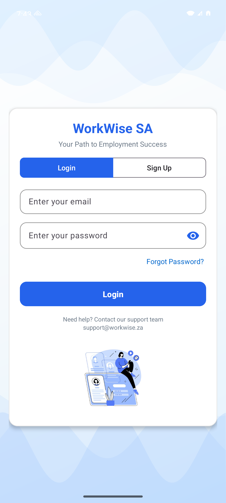
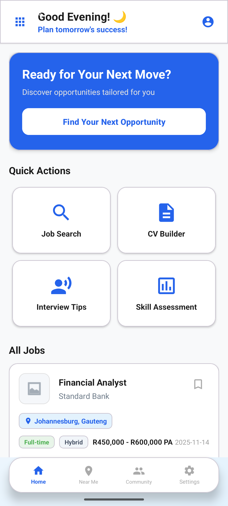
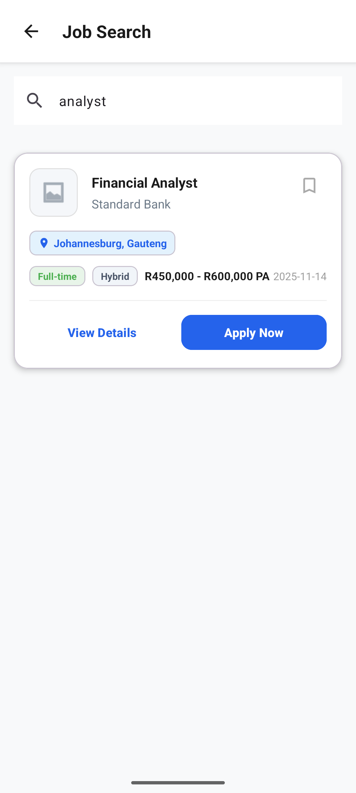
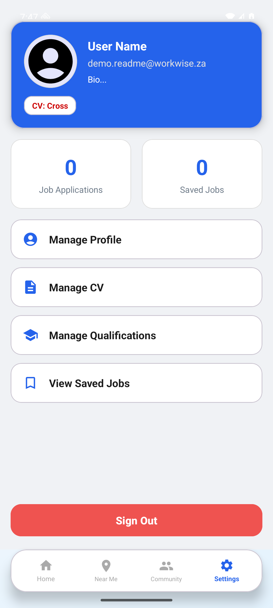
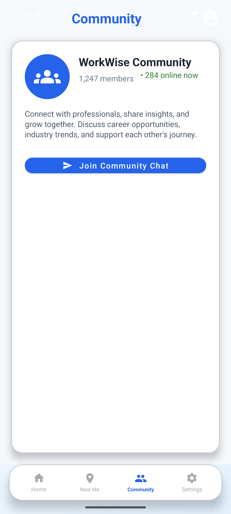
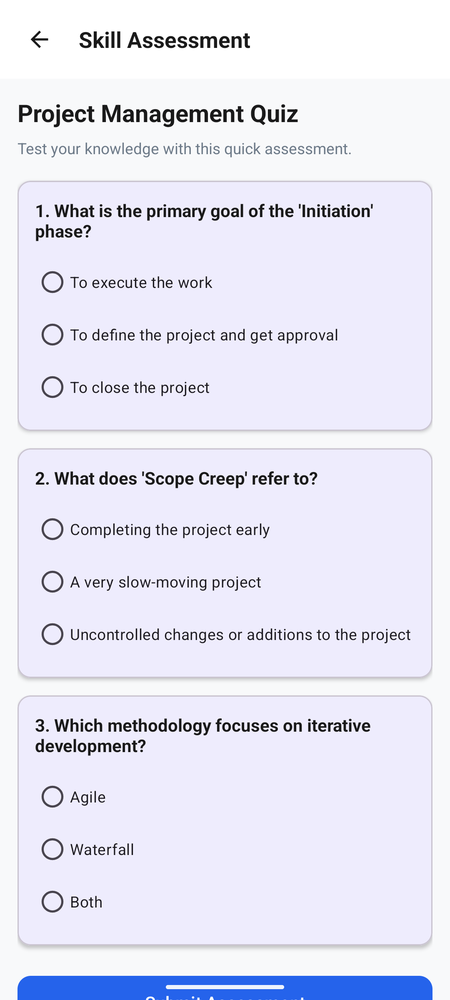
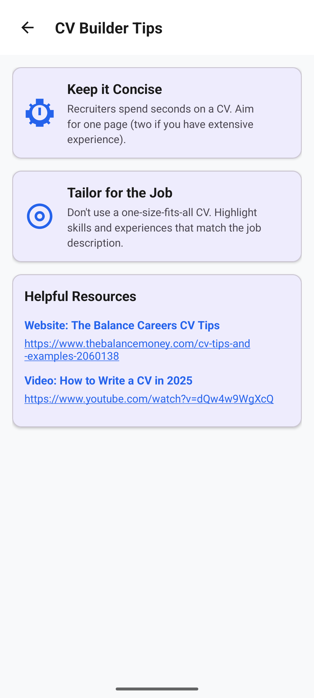
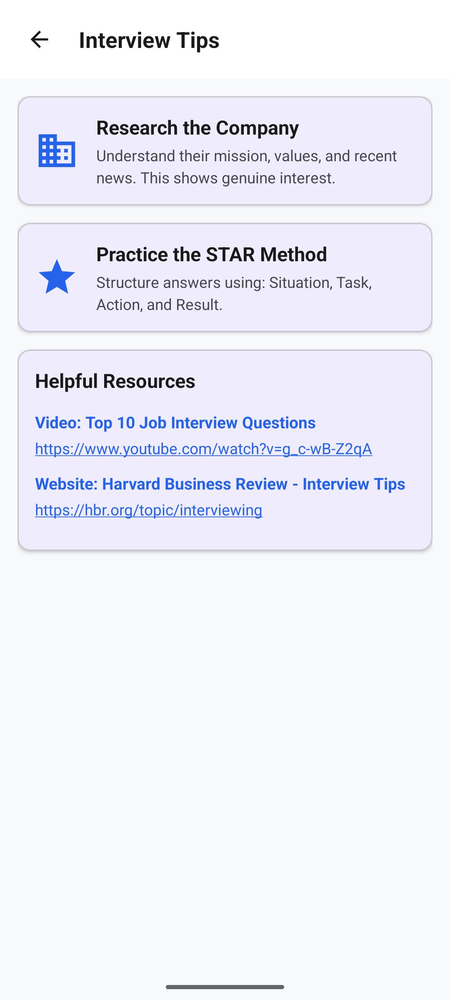
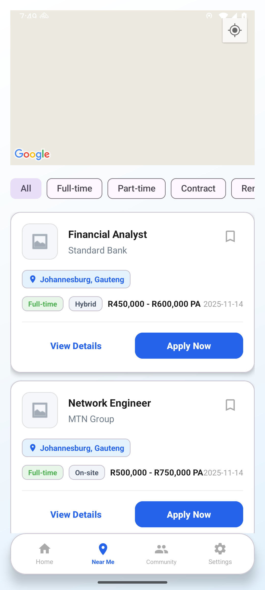

<h1 align="center">Workwise 💼</h1>

<p align="center">
  <strong>An Android job-seeking app for the South African market.</strong><br/>
  Search and save jobs, keep your CVs and qualifications in one place, find work near you on a map,
  and message other job seekers. The native client for the
  <a href="https://github.com/Nevvyboi/WorkwiseWeb">WorkwiseWeb</a> API.
</p>

<p align="center">
  
  
  
  
  
  <a href="LICENSE"></a>
</p>

---

## 📖 Table of Contents

- [✨ What is Workwise?](#-what-is-workwise)
- [🎬 The Screens](#-the-screens)
- [🏗️ Architecture](#️-architecture)
- [🔌 The Backend](#-the-backend)
- [⚡ Tech Stack](#-tech-stack)
- [🚀 Building It](#-building-it)
- [📁 Project Structure](#-project-structure)
- [🔒 Security Notes](#-security-notes)
- [📄 License](#-license)

---

## ✨ What is Workwise?

Looking for work is admin. Your CV is in one place, the job listings are in another, the
qualifications you keep retyping are in a third, and the job that is actually a ten minute taxi
ride away never surfaces because nothing you use knows where you are.

Workwise puts those in one Android app: **search jobs, save the good ones, keep several CVs and
pick a primary, record your qualifications once, see what is hiring near you on a map, and message
other job seekers.** It is a native Java client backed by a FastAPI service, so the phone stays
thin and the data lives server side.

> 🎓 Built as a mobile development project. It runs against a live deployment of
> [WorkwiseWeb](https://github.com/Nevvyboi/WorkwiseWeb), so a fresh install has real data in it.

---

## 🎬 The Screens

<p align="center">
  
  
  
</p>

<p align="center">
  
  
  
</p>

<p align="center">
  
  
  
</p>

> 📸 Captured on an Android 16 emulator against the live WorkwiseWeb backend, so the job listings
> are real data. In the **near me** shot the map panel is blank because the build used for these
> screenshots is not signed with the release certificate the Maps key is restricted to; on a
> properly signed build the map renders normally.

Nineteen activities, grouped by what they are for.

### 🔐 Getting in

| Screen | What it does |
|---|---|
| `authentication` | Launcher activity. Login and registration in one place. |
| `forgotPassword` | Requests a reset code by email. |
| `verifyResetCode` | Confirms the emailed code. |
| `resetPassword` | Sets the new password once the code checks out. |

### 💼 Finding work

| Screen | What it does |
|---|---|
| `home` | Landing screen after login, with the bottom navigation and user stats. |
| `JobSearchActivity` | Search and filter the job listings. |
| `jobapt` | Job detail and application view. |
| `nearme` | Google Maps view of jobs around your current location. |
| `settingsviewsavedjobs` | Everything you have saved, ready to revisit. |

### 📄 Your paperwork

| Screen | What it does |
|---|---|
| `managecv` / `settingsmanagecv` | Upload several CVs, mark one as primary, delete the rest. |
| `pdfviewer` | Reads a CV back inside the app, no external viewer needed. |
| `settingsqualifications` | Add, edit and remove qualifications. |
| `settingsprofile` | Personal details, bio, contact info and profile photo. |

### 🤝 Everything else

| Screen | What it does |
|---|---|
| `community` | The community area. |
| `chatActivity` | One to one messaging, backed by a conversation API. |
| `SkillAssessmentActivity` | Self assessment for skills. |
| `CvTipsActivity` / `InterviewTipsActivity` | Written guidance on CVs and interviews. |
| `setting` | Settings hub that reaches the profile, CV and qualification screens. |

---

## 🏗️ Architecture

```
  📱 Activity  ──►  apiService (Retrofit interface)
                         │
                         ▼
                    apiClient  ──►  OkHttp + Gson + logging interceptor
                         │
                         ▼
              🌐 WorkwiseWeb (FastAPI)  ──►  SQLite
                         │
                         ▼
                    models/*.java   typed request and response objects
```

* **`network/`** holds the whole HTTP layer. `apiConfig` carries the base URL and the per endpoint
  tokens, `apiService` is the Retrofit interface, and `apiClient` builds the configured client.
* **`models/`** is one small class per request and response shape, about 30 of them, so responses
  are typed rather than parsed by hand.
* **`ui/`** carries the pieces every screen shares: `bottomNav` for navigation, `backgroundView`
  for the shared background, and `baseNetworkCheck` so screens react to losing signal.
* **`utils/networkMonitor`** watches connectivity and drives the `networkloading` layout.

---

## 🔌 The Backend

Workwise does not talk to a database directly. Every screen goes through
**[WorkwiseWeb](https://github.com/Nevvyboi/WorkwiseWeb)**, a FastAPI service that owns
authentication, profiles, CV storage, qualifications, job listings, saved jobs and chat.

There is no hosted instance any more, so **run the backend yourself** and point the app at it.
Both settings live in `local.properties`, which is gitignored:

```properties
# local.properties
apiBaseUrl=http://10.0.2.2:8000/     # 10.0.2.2 is the host machine, seen from the emulator
apiToken=your-shared-endpoint-token   # must match WORKWISE_ENDPOINT_TOKEN on the backend
mapsApiKey=your-google-maps-key       # optional, only the map needs it
```

`build.gradle.kts` reads those into `BuildConfig` and `apiConfig` exposes them, so no URL or
secret is ever compiled in from source control. Copy `local.properties.example` to get started.

Every protected route is authorised with that one shared token, sent as an `X-Endpoint-Token`
header. See [Security Notes](#-security-notes) before treating it as real authentication.

---

## ⚡ Tech Stack

| Layer | Technology |
|---|---|
| 🤖 Platform | Android, Java, minSdk 24, targetSdk 36 |
| 🔧 Build | Gradle with the Kotlin DSL, version catalog |
| 🌐 Networking | Retrofit 2.9, OkHttp logging interceptor, Gson |
| 🗺️ Maps & location | Play Services Maps 18.2, Play Services Location 21.3 |
| 🖼️ Images | Glide 4.16, PhotoView for pinch to zoom |
| 📄 Documents | android-pdf-viewer 3.2 for in app CV viewing |
| 🎨 UI | Material Components 1.12, ConstraintLayout, RecyclerView |

**Permissions requested:** fine and coarse location (the near me map), internet plus network and
wifi state (connectivity monitoring), and read external storage (picking a CV to upload).

---

## 🚀 Building It

**Prerequisites:** Android Studio (Ladybug or newer), JDK 17, and an emulator or device on API 24+.

```bash
git clone https://github.com/Nevvyboi/Workwise.git
cd Workwise
./gradlew assembleDebug          # or just open the folder in Android Studio and hit Run
```

The debug APK lands in `app/build/outputs/apk/debug/`.

To install it straight onto a connected device:

```bash
./gradlew installDebug
```

Before the app can do anything useful it needs a backend. Start
[WorkwiseWeb](https://github.com/Nevvyboi/WorkwiseWeb) locally, put its token and URL in
`local.properties` as shown above, and then register an account from the app.

---

## 📁 Project Structure

```
Workwise/
├── app/src/main/
│   ├── java/com/workwise/
│   │   ├── authentication.java      🔐 Launcher: login and registration
│   │   ├── home.java                🏠 Post-login landing screen
│   │   ├── community.java           🤝 Community area
│   │   ├── nearme.java              🗺️ Jobs on a map around you
│   │   ├── setting.java             ⚙️ Settings hub
│   │   ├── jobs/                    💼 Job search and application
│   │   ├── cv/                      📄 CV management
│   │   ├── pdfviewer/               👀 In-app PDF reader
│   │   ├── chat/                    💬 Messaging and its adapter
│   │   ├── assessment/              📊 Skill self-assessment
│   │   ├── resources/               💡 CV and interview tips
│   │   ├── email/                   ✉️ Forgot / verify / reset password
│   │   ├── settings/                🧾 Profile, CVs, qualifications, saved jobs
│   │   ├── network/                 🌐 Retrofit client, service, config
│   │   ├── models/                  📦 ~30 typed request/response classes
│   │   ├── ui/                      🧱 Bottom nav, background, network check
│   │   └── utils/                   🛠️ Connectivity monitor
│   ├── res/layout/                  🎨 31 layouts
│   └── AndroidManifest.xml
├── app/build.gradle.kts
└── gradle/libs.versions.toml        📚 Version catalog
```

---

## 🔒 Security Notes

Being straight about this, because it is a student project and the code is public:

* **No secrets live in this repository.** The base URL, the endpoint token and the Maps key all come
  from `local.properties` (or matching environment variables) through `BuildConfig`. An earlier
  version of this repo hardcoded all three; those values have been removed and the credentials they
  referred to were retired.
* **The shared token is not real authentication.** One token guards every protected route, and it
  ships inside the APK, so anyone who unpacks a build has it. It keeps casual traffic off the API
  and nothing more. Real auth means per user credentials and a session token issued at login.
* **Cleartext traffic is enabled** (`usesCleartextTraffic="true"`) so a local HTTP backend works
  during development. Turn it off before shipping anything.
* **Git history still holds the old values.** Removing them from the working tree does not remove
  them from previous commits. They have been retired, so this is tidiness rather than exposure, but
  keep it in mind before restoring anything from an old commit.

---

## 📄 License

Released under the [MIT License](LICENSE), free to use, modify, and build on, with attribution.

---

<p align="center">
  <sub>Built in South Africa 🇿🇦 · Backend at <a href="https://github.com/Nevvyboi/WorkwiseWeb">WorkwiseWeb</a></sub>
</p>
